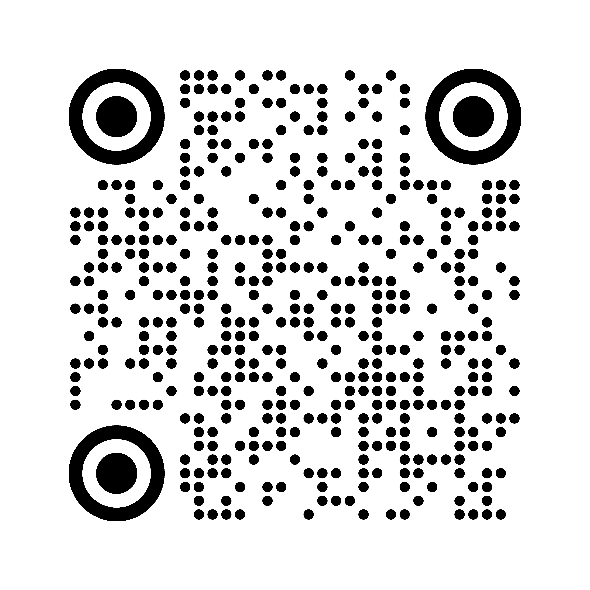

# QR Code Generator
A CLI tool to generate QR Code

## Installation
Make sure that you have make installed on your pc
```bash
make install
```

## Usage
```bash
py main.py <your-data> <output-file-name> --style <rounded|pixel|circle|v-bars|h-bars> --image <path/to/image>
```

Example:
| Command | Output |
| ------- | ------ |
|`py main.py "Lorem ipsum dolor sit amet" "sample-square" ` |  |
|`py main.py "Lorem ipsum dolor sit amet" "sample-rounded"  --style rounded` |  |
|`py main.py "Lorem ipsum dolor sit amet" "sample-pixel"  --style pixel` |  |
|`py main.py "Lorem ipsum dolor sit amet" "sample-circle"  --style circle` |  |
|`py main.py "Lorem ipsum dolor sit amet" "sample-v-bars"  --style v-bars` |  |
|`py main.py "Lorem ipsum dolor sit amet" "sample-h-bars"  --style h-bars` |  |
|`py main.py "Lorem ipsum dolor sit amet" "sample-image"  --image "./logo.png"` |  |